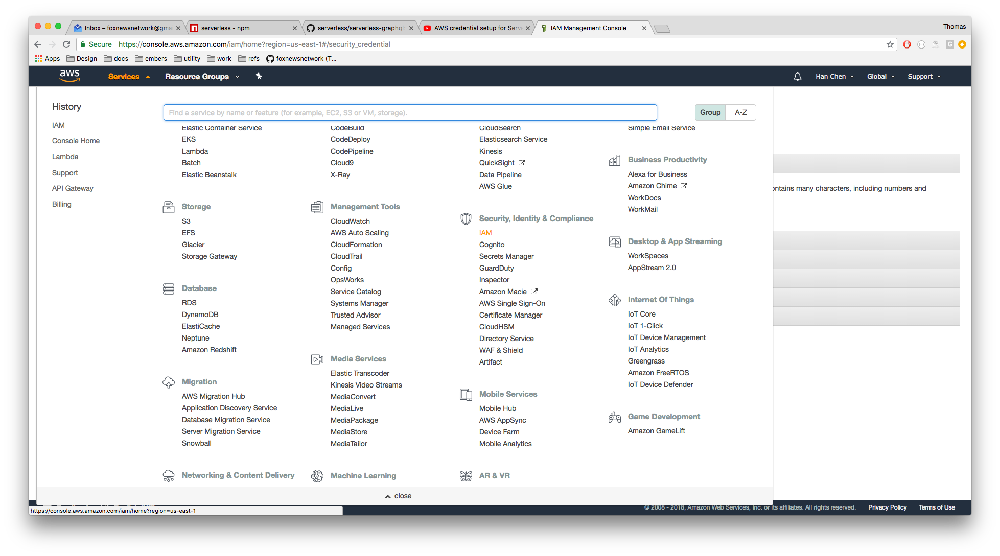
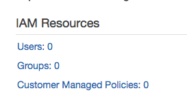
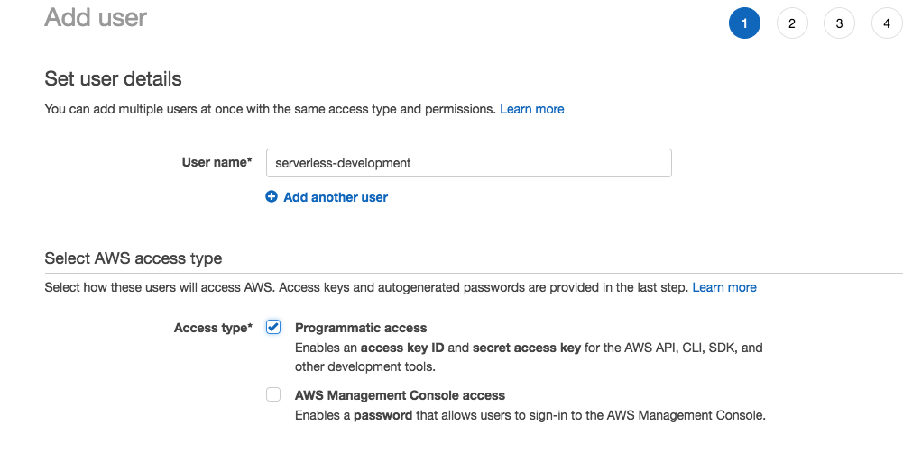
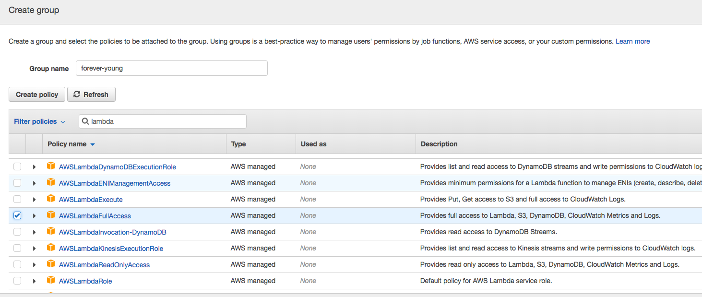
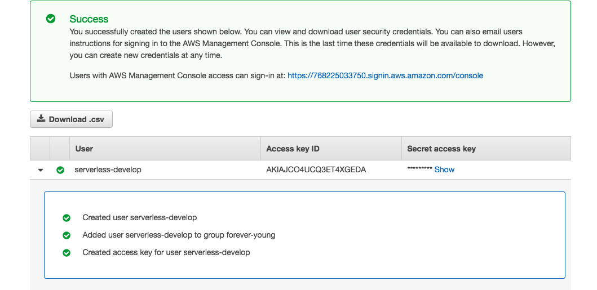

# Serverless Deployment and Development

We deploy the back-end of this project to something like aws lambda. This guide will cover the following:

- Initial setup
- Offline development
- Staging and deployment

## Setting up with AWS

*Overview*: We cover how to connect and setup your aws with the `serverless` cli tool

### Prerequistes

- You have an AWS account in good standing
- You have already performed `yarn global add serverless`

### Step 1: Access the IAM console

Access the IAM console via `Servervices > Security and Identity & Compliance > IAM`



### Step 2: Enter user console

Click the `Users` link in the IAM resources section to access the Users console:



### Step 3: Create an user

Click the "add user" button name it something like `serverless-development`. Give it programmatic access:




### Step 4: Create a group

For best security practices, we should put these users into groups. Create a new group (name it something like "forever-young") and assign it the following permissions:

- `LambdaFullAccess`
- `AppSyncAdministrator`
- `APIGatewayFullAccess`
- `RDSFullAccess`
- `DynamoDBFullAccess`




### Step 5: Configure serverless

After you've created the user and added it to the group, you should be taken to the following screen:



Next, do the following

- Download the CSV file
- Get it and run the following terminal command with the `access key id` and `secret key` you got from it:

```zsh
serverless config credentials --provider aws --key YOUR_ACCESS_KEY --secret YOUR_SECRET_TOKEN
```


## References

- [NPM serverless](https://www.npmjs.com/package/serverless#quick-start)
- [Setting up provider credentials via aws](https://www.youtube.com/watch?v=HSd9uYj2LJA)
- [Serverless graphQL example](https://github.com/serverless/serverless-graphql)
- [Serverless examples](https://github.com/serverless/examples)